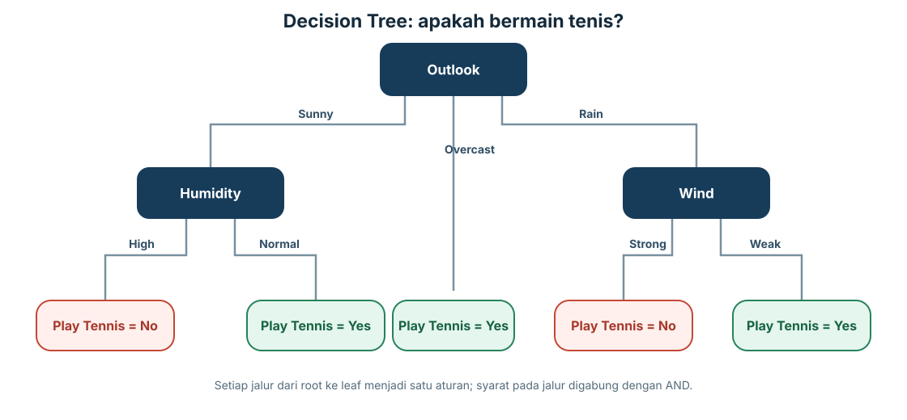
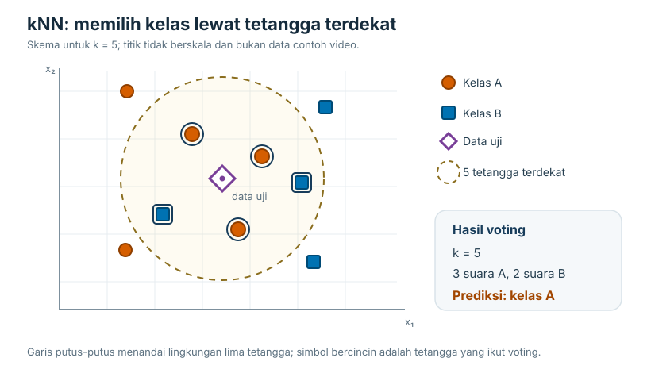
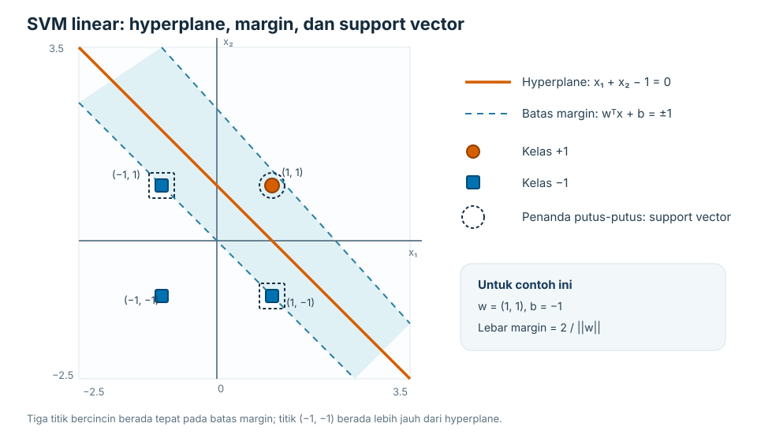
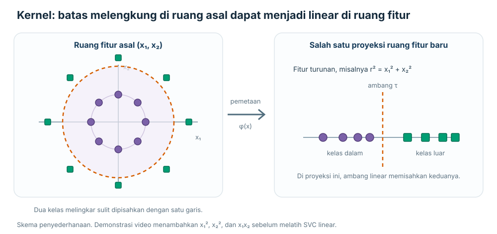

# Materi Pembelajaran Mesin: Decision Tree, kNN, dan SVM

Ketiga metode ini termasuk **supervised learning**: model belajar dari data yang sudah memiliki label, lalu menggunakan pola yang dipelajari untuk mengklasifikasikan data baru. Cara mereka mengambil keputusan berbeda. Decision Tree menyusun serangkaian pertanyaan, kNN membandingkan data baru dengan contoh yang paling mirip, sedangkan SVM mencari batas pemisah yang memberi jarak aman paling lebar antara kelas.

Decision Tree dan SVM biasanya membentuk model saat proses training selesai; pendekatan ini disebut **eager learning**. kNN termasuk **lazy learning** karena menyimpan data latih dan menunda sebagian besar perhitungan sampai ada data yang perlu diprediksi.

Materi ini berfokus pada **klasifikasi**, sesuai isi video. Pembahasan kNN untuk regresi, SVM soft-margin, dan evaluasi model yang lebih lengkap tidak dijelaskan dalam transkrip. Istilah training, validation, dan testing tetap dipakai karena istilah tersebut juga digunakan dalam perkuliahan.

## 1. Decision Tree

### Gagasan dasar

Decision Tree (pohon keputusan) menggambarkan proses mengambil keputusan sebagai rangkaian pengujian terhadap fitur. Setiap node memeriksa satu fitur, cabang menunjukkan hasil pengujiannya, dan leaf node menyimpan kelas yang diprediksi.

- **Root node** adalah pengujian pertama di bagian paling atas.
- **Internal node** adalah pengujian lanjutan di bawah root.
- **Branch** adalah hasil yang mungkin dari suatu pengujian, misalnya `Outlook = Rain` atau `Humidity = High`.
- **Leaf node** adalah ujung pohon yang berisi prediksi, misalnya `Play Tennis = Yes`.

Kedalaman pohon menunjukkan panjang jalur terpanjang dari root ke bagian terbawah pohon. Pada video, depth dihitung dari root sampai internal node terakhir, sehingga root yang diikuti satu internal node disebut memiliki depth 1. Buku atau library tertentu menghitung jumlah edge sampai leaf; karena itu, periksa konvensi yang dipakai ketika membandingkan nilai depth. Pada saat memprediksi, data baru mengikuti cabang sesuai nilai fiturnya sampai tiba di leaf.

*Gambar 1. Cabang `Overcast` langsung berakhir di leaf. Cabang `Sunny` dan `Rain` memerlukan satu pengujian lagi.*

### Cara pohon dibangun

Proses training dimulai dengan menempatkan seluruh data latih di root. Algoritma memilih fitur untuk membagi data ke beberapa kelompok. Jika semua anggota suatu kelompok memiliki label yang sama, kelompok itu sudah **pure** dan dapat menjadi leaf. Jika labelnya masih bercampur, algoritma memilih fitur lain dan membagi kelompok itu lagi. Proses berulang sampai kelompok cukup murni atau ada aturan penghentian.

Urutan pembentukan pohonnya dapat dibaca seperti ini:

1. Letakkan seluruh data training pada root.
2. Hitung kualitas setiap kandidat split.
3. Pilih fitur dengan hasil split terbaik.
4. Bagi data ke cabang-cabang sesuai nilai fitur tersebut.
5. Jadikan cabang sebagai leaf jika isinya sudah pure. Jika belum, ulangi proses pada cabang itu.
6. Hentikan pertumbuhan ketika semua cabang sudah selesai atau aturan penghentian telah terpenuhi.

Untuk memilih fitur, algoritma seperti ID3 mengukur seberapa banyak ketidakpastian label berkurang setelah data dibagi. Ukuran ketidakpastian itu disebut **entropy**:

`H(S) = -Σ p(c) log₂ p(c)`

`S` adalah kumpulan data, `c` adalah kelas, dan `p(c)` adalah proporsi data dengan kelas tersebut. Pada kasus dua kelas, campuran 50:50 memiliki entropy 1, nilai tertinggi untuk kasus biner. Kelompok yang seluruh anggotanya berada di satu kelas memiliki entropy 0.

Setelah itu, algoritma menghitung **information gain** untuk tiap fitur:

`Gain(S, A) = H(S) - Σᵥ (|Sᵥ| / |S|) H(Sᵥ)`

`A` adalah fitur yang diuji, `v` adalah salah satu nilai fitur tersebut, dan `Sᵥ` adalah data yang masuk ke cabang dengan nilai `v`. Fitur dengan gain terbesar dipilih karena paling banyak mengurangi ketidakpastian setelah pembagian.

Dalam contoh klasifikasi keputusan bermain tenis, terdapat 14 sampel: 9 berlabel `Yes` dan 5 berlabel `No`. Entropy awalnya dihitung sebagai berikut:

`H(S) = -(9/14) log₂(9/14) - (5/14) log₂(5/14) ≈ 0,940`

Setelah entropy setiap hasil split dihitung, information gain di root menghasilkan nilai berikut:

| Fitur | Information gain |
|---|---:|
| Outlook | 0,247 |
| Humidity | 0,152 |
| Wind | 0,048 |

Karena `Outlook` memiliki gain tertinggi, fitur itu menjadi root. Cabang `Overcast` langsung menghasilkan kelas `Yes`, sehingga tidak perlu dibagi lagi. Cabang `Sunny` masih memiliki label campuran dan dipisah dengan `Humidity`: `High` menghasilkan `No`, sedangkan `Normal` menghasilkan `Yes`. Cabang `Rain` dipisah dengan `Wind`: `Strong` menghasilkan `No`, sedangkan `Weak` menghasilkan `Yes`.

Karena pemilihan fitur dilakukan pada setiap node berdasarkan data yang tersisa di node itu, fitur terbaik berikutnya dapat berbeda di cabang yang berbeda. Pada contoh ini, information gain untuk `Humidity` di cabang `Sunny` adalah sekitar 0,971, sedangkan `Wind` sekitar 0,020. Di cabang `Rain`, urutannya terbalik: `Wind` sekitar 0,971 dan `Humidity` sekitar 0,020.

Untuk data baru dengan `Outlook = Rain`, `Humidity = High`, dan `Wind = Weak`, pohon memeriksa `Outlook` terlebih dahulu, lalu `Wind`. Prediksinya `Yes`. `Humidity` tidak memengaruhi jalur ini karena pohon tidak mengujinya di cabang `Rain`.

### Mengubah pohon menjadi aturan

Setiap jalur dari root ke leaf dapat ditulis sebagai satu aturan. Syarat-syarat pada satu jalur digabungkan dengan **AND**:

- Jika `Outlook = Sunny` **dan** `Humidity = High`, maka `Play Tennis = No`.
- Jika `Outlook = Sunny` **dan** `Humidity = Normal`, maka `Play Tennis = Yes`.
- Jika `Outlook = Overcast`, maka `Play Tennis = Yes`.
- Jika `Outlook = Rain` **dan** `Wind = Strong`, maka `Play Tennis = No`.
- Jika `Outlook = Rain` **dan** `Wind = Weak`, maka `Play Tennis = Yes`.

Dengan demikian, pohon pada contoh tersebut menghasilkan lima aturan, satu untuk setiap leaf. Jika beberapa jalur menuju kelas yang sama, aturan-aturannya dapat digabung dengan **OR**, selama kondisi tiap jalur tetap ditulis dengan benar.

### Fitur numerik dan kategorikal

Fitur numerik dapat dibagi menggunakan ambang. Pada contoh video, nilai kelembapan diurutkan, nilai uniknya diambil, lalu setiap nilai diperiksa sebagai kandidat batas: `Humidity ≤ 65` dibandingkan dengan `Humidity > 65`, kemudian `Humidity ≤ 70` dibandingkan dengan `Humidity > 70`, dan seterusnya. Setiap kandidat dinilai dengan ukuran split yang sama. Implementasi Decision Tree juga dapat memakai titik tengah antara dua nilai berurutan sebagai kandidat ambang, sehingga aturan yang dihasilkan tidak bergantung pada apakah suatu nilai training muncul kembali pada data baru.

Fitur kategorikal biner dapat direpresentasikan dengan `0` dan `1` jika algoritma atau pipeline membutuhkannya. Untuk kategori nominal dengan lebih dari dua nilai, seperti `Sunny`, `Overcast`, dan `Rain`, pemetaan langsung menjadi `0`, `1`, dan `2` dapat memberi kesan bahwa kategori tersebut memiliki urutan atau jarak. **One-hot encoding** menghindari kesan itu dengan membuat satu fitur biner untuk tiap kategori:

| Outlook | Sunny | Overcast | Rain |
|---|---:|---:|---:|
| Sunny | 1 | 0 | 0 |
| Overcast | 0 | 1 | 0 |
| Rain | 0 | 0 | 1 |

Data lain juga perlu diubah menjadi fitur yang bisa diproses model. Gambar 28 × 28 piksel, misalnya, dapat diratakan menjadi vektor berisi 784 nilai intensitas. Teks dapat direpresentasikan, salah satunya, dengan frekuensi kemunculan kata.

Kebutuhan encoding bergantung pada implementasi. Sebagian algoritma pohon dapat memisahkan kategori secara langsung, sedangkan pipeline yang hanya menerima angka memerlukan encoding terlebih dahulu.

### Overfitting dan cara mengendalikannya

Pohon yang terus tumbuh bisa menghafal detail yang hanya muncul di data latih, termasuk label yang keliru atau noise. Akurasi training mungkin naik saat pohon bertambah besar, tetapi kinerja pada data baru dapat turun. Inilah **overfitting**. Risiko ini juga meningkat jika data latih terlalu sedikit atau belum mewakili variasi kasus yang akan ditemui.

Ada dua pendekatan utama untuk mengendalikan ukuran pohon:

1. **Pre-pruning**: menghentikan pemecahan lebih awal, misalnya ketika pembagian berikutnya tidak membantu pada data validasi.
2. **Post-pruning**: membiarkan pohon tumbuh, lalu memangkas cabang yang tidak membantu generalisasi.

Data dibagi menjadi training, validation, dan testing. Training digunakan untuk membangun pohon. Validation membantu memilih kapan berhenti atau cabang mana yang perlu dipangkas. Testing disimpan untuk menilai kinerja akhir setelah pilihan model ditetapkan.

### C4.5 dan gain ratio

C4.5 mengembangkan pendekatan ID3 dengan memakai **gain ratio** untuk memilih pembagian:

`GainRatio(S, A) = Gain(S, A) / SplitInfo(S, A)`

`SplitInfo` mengukur seberapa banyak data tersebar ke cabang-cabang fitur:

`SplitInfo(S, A) = -Σᵢ (|Sᵢ| / |S|) log₂(|Sᵢ| / |S|)`

Pembagian yang membuat banyak cabang kecil dapat menghasilkan information gain tinggi. Gain ratio menyesuaikan nilai itu dengan memperhitungkan sebaran cabangnya, sehingga fitur dengan banyak kemungkinan nilai tidak otomatis selalu diuntungkan. Perbedaan utama yang dibahas antara ID3 dan C4.5 ada pada ukuran yang digunakan saat memilih split.

## 2. k-Nearest Neighbors (kNN)

### Gagasan dan cara kerja

kNN menganggap data yang memiliki fitur mirip cenderung memiliki label yang sama. Saat training, kNN umumnya menyimpan vektor fitur beserta labelnya. Ketika ada data baru, algoritma menghitung jaraknya ke data latih, mengambil `k` tetangga dengan jarak terkecil, lalu menentukan kelas berdasarkan suara terbanyak.

Untuk data uji `x`, jika `Nₖ(x)` adalah kumpulan `k` tetangga terdekat, prediksinya dapat ditulis sebagai:

`ŷ = mode { yᵢ : xᵢ ∈ Nₖ(x) }`

Jadi, keputusan kNN bergantung pada dua pilihan penting: ukuran jarak dan nilai `k`.

Untuk memprediksi satu data baru, langkahnya adalah:

1. Lakukan preprocessing dan ekstraksi fitur yang sama seperti pada data training.
2. Hitung jarak data baru terhadap setiap data training.
3. Urutkan hasilnya dari jarak terkecil.
4. Ambil `k` data teratas.
5. Hitung jumlah label pada tetangga tersebut dan pilih label yang paling banyak muncul.

Pada **1-nearest neighbor**, hanya satu tetangga terdekat yang menentukan kelas. Daerah yang dimiliki tiap sampel membentuk **Voronoi tessellation**: batas antardaerah berada pada titik-titik yang berjarak sama dari dua sampel. Batas klasifikasinya bisa berliku-liku dan mengikuti sebaran data. Dengan lebih banyak tetangga, prediksi menggunakan suara mayoritas sehingga batasnya biasanya lebih stabil.

*Gambar 2. Pada skema ini, tiga dari lima tetangga berasal dari kelas A, jadi kNN memilih kelas A.*

Contoh kertas tisu di video menggunakan fitur ketahanan terhadap asam dan kekuatan. Kertas baru memiliki nilai fitur `(3, 7)`. Menurut urutan jarak pada contoh, tetangga pertama berlabel kualitas tinggi (`T`). Dari tiga tetangga terdekat, dua berlabel `T` dan satu berlabel kualitas rendah (`R`), jadi prediksi dengan `k = 1` maupun `k = 3` adalah `T`.

### Memilih ukuran jarak

Jika fitur numerik memiliki `D` dimensi, beberapa ukuran jarak yang umum dipakai adalah:

| Ukuran | Rumus | Kegunaan atau ciri |
|---|---|---|
| Euclidean | `d(x,z) = √Σⱼ(xⱼ - zⱼ)²` | Jarak lurus; pilihan yang umum untuk fitur numerik. |
| Manhattan | `d(x,z) = Σⱼ|xⱼ - zⱼ|` | Menjumlahkan selisih absolut tiap fitur. |
| Chebyshev | `d(x,z) = maxⱼ |xⱼ - zⱼ|` | Hanya memakai selisih terbesar pada satu fitur. |
| Minkowski | `dₚ(x,z) = (Σⱼ|xⱼ - zⱼ|ᵖ)^(1/p)` | Bentuk umum: `p = 1` menjadi Manhattan, `p = 2` menjadi Euclidean, dan limit `p → ∞` menjadi Chebyshev. |
| Hamming | `d(x,z) = Σⱼ 1[xⱼ ≠ zⱼ]` | Menghitung jumlah fitur kategorikal yang nilainya berbeda. |
| Mahalanobis | `d(x,z) = √((x-z)ᵀ Σ⁻¹ (x-z))` | Memperhitungkan skala dan hubungan antarfitur melalui matriks kovarians `Σ`. |

Euclidean distance bersifat simetris: jarak dari `x` ke `z` sama dengan jarak dari `z` ke `x`. Namun, skala fitur tetap berpengaruh besar. Jika satu fitur berkisar antara 0 dan 100, sedangkan fitur lain antara 0 dan 1.000.000, selisih fitur berskala besar dapat mendominasi hasil jarak.

Contoh di video memakai `P₁ = (0, 2)` dan `P₂ = (2, 0)`. Jarak Euclidean keduanya adalah:

`d(P₁,P₂) = √((0-2)² + (2-0)²) = √8 = 2√2 ≈ 2,83`

Untuk `P₃ = (3, 1)` dan `P₄ = (5, 1)`, jaraknya adalah:

`d(P₃,P₄) = √((3-5)² + (1-1)²) = √4 = 2`

Karena `2 < 2,83`, pasangan `P₃` dan `P₄` lebih dekat menurut Euclidean distance.

Karena itu, fitur numerik biasanya perlu diskalakan sebelum jarak dihitung. Dua cara yang umum adalah:

- **Standardisasi** atau zero mean, unit variance: `z = (x - μ) / σ`, dengan `μ` sebagai rata-rata dan `σ` sebagai simpangan baku fitur.
- **Min-max scaling**: `x' = (x - x_min) / (x_max - x_min)`, yang memetakan nilai ke rentang 0–1.

Parameter skala dihitung dari data training, lalu diterapkan juga ke validation dan testing. Jika ada nilai yang hilang, jarak tidak dapat dihitung dengan lengkap. Untuk fitur numerik, salah satu cara sederhana adalah mengisi nilai kosong dengan rata-rata fitur; untuk fitur kategorikal, gunakan nilai kategori yang sesuai, misalnya kategori yang paling sering muncul.

### Memilih `k` dan menangani kasus khusus

Nilai `k` kecil membuat keputusan peka terhadap titik lokal dan label yang salah. Pada `k = 1`, satu outlier dapat mengubah batas klasifikasi di sekitarnya. Nilai `k` yang besar membuat prediksi lebih halus, tetapi kelas yang jumlahnya dominan dapat lebih sering menang.

Untuk klasifikasi dua kelas, nilai `k` ganjil sering dipilih agar peluang seri berkurang. Namun, pada banyak kelas, seri masih mungkin terjadi. Aturan pemecah seri sebaiknya ditetapkan sejak awal, misalnya memilih kelas dengan prior yang lebih tinggi atau menggunakan aturan deterministik lain.

Tidak ada satu nilai `k` yang selalu cocok. Uji beberapa nilai pada validation set, lalu pilih yang memberi kinerja terbaik untuk tujuan tugas. Ukuran jarak juga dapat diperlakukan sebagai pilihan model yang diuji.

kNN dasar juga tidak langsung menghasilkan probabilitas yang terkalibrasi. Proporsi suara tetangga, misalnya 4 dari 5, dapat dibaca sebagai kekuatan voting, tetapi tidak otomatis berarti peluang kejadian sebesar 80%.

Karena kNN membandingkan data uji dengan banyak atau seluruh data training, satu prediksi langsung memerlukan kira-kira `O(ND)` perhitungan untuk `N` sampel dan `D` fitur, serta model perlu menyimpan vektor training. Pencarian dapat dipercepat dengan mengurangi fitur, memilih sampel yang representatif, atau memakai indeks pencarian seperti kd-tree. Untuk data tertentu, inverted index sering digunakan pada pencarian teks dan locality-sensitive hashing pada pencarian kemiripan berskala besar. Teknik indeks tidak selalu membantu dengan cara yang sama, terutama saat dimensinya tinggi.

## 3. Support Vector Machine (SVM)

### Hyperplane dan margin

SVM mencari batas yang memisahkan dua kelas. Untuk klasifikasi biner, label sering ditulis sebagai `yᵢ ∈ {−1, +1}`. Pada data berdimensi dua, batasnya berupa garis. Pada tiga dimensi, batasnya berupa bidang. Secara umum batas ini disebut **hyperplane** dan ditulis:

`wᵀx + b = 0`

Prediksi kelasnya adalah tanda dari skor tersebut:

`f(x) = sign(wᵀx + b)`

Jika skor positif, data masuk ke kelas `+1`; jika negatif, data masuk ke kelas `−1`. Banyak garis bisa memisahkan data yang sama dengan benar. SVM memilih yang marginnya paling lebar, yaitu jarak antara hyperplane dan sampel terdekat dari tiap kelas.

Alur SVM linear pada materi ini dapat diringkas menjadi empat tahap:

1. Cari hyperplane yang mampu memisahkan dua kelas.
2. Tentukan sampel terdekat dari masing-masing kelas. Sampel inilah yang menjadi support vector.
3. Ukur margin di antara kedua kelas.
4. Pilih hyperplane dengan margin paling lebar, lalu gunakan tanda `wᵀx + b` untuk memprediksi data baru.

Sampel yang membatasi margin disebut **support vector**. Titik-titik inilah yang menentukan posisi hyperplane; sampel lain yang berada jauh dari batas tidak menentukan margin secara langsung. Margin lebar menjadi tujuan karena biasanya memberi batas yang lebih tahan terhadap perubahan kecil pada data.

*Gambar 3. Garis penuh adalah hyperplane; garis putus-putus membatasi margin. Titik bercincin berada tepat di batas margin.*

Garis batas margin dapat ditulis `wᵀx + b = +1` dan `wᵀx + b = −1`. Jarak di antara keduanya adalah `2 / ||w||`. Memaksimalkan margin sama dengan meminimalkan panjang `w`. Untuk kasus yang dapat dipisahkan sempurna, optimasinya dapat ditulis:

`minimize ½ ||w||²`

dengan syarat:

`yᵢ (wᵀxᵢ + b) ≥ 1` untuk setiap sampel training `i`.

Syarat tersebut adalah formulasi **hard-margin**: semua sampel training harus dapat dipisahkan tanpa pelanggaran. Video membahas kasus ini sebagai dasar matematis. Data yang saling tumpang tindih atau mengandung noise biasanya memerlukan SVM soft-margin, yang mengizinkan sejumlah pelanggaran agar batas tidak terlalu mengikuti data training. Detail fungsi objektif dan parameter `C` tidak dibahas dalam transkrip.

### Contoh SVM linear

Contoh sederhana dalam video memiliki satu sampel positif di `(1, 1)` dan tiga sampel negatif di `(1, −1)`, `(−1, 1)`, serta `(−1, −1)`. Hyperplane dengan `w = (1, 1)` dan `b = −1` adalah:

`x₁ + x₂ − 1 = 0`

Titik `(1, 1)`, `(1, −1)`, dan `(−1, 1)` menjadi support vector pada contoh tersebut. Untuk data uji `(1, 5)`, nilai `x₁ + x₂ − 1` positif sehingga kelasnya `+1`. Untuk `(2, −2)`, nilainya negatif sehingga kelasnya `−1`.

### Data yang tidak bisa dipisahkan garis lurus

Ada data yang kelasnya tidak dapat dipisahkan dengan satu hyperplane di ruang asal. Misalnya, satu kelas mengelilingi kelas lain. Jika tetap memaksakan batas linear, banyak sampel akan salah klasifikasi.

Salah satu cara mengatasinya adalah memetakan fitur ke ruang berdimensi lebih tinggi. Di ruang baru, data yang tadinya tidak bisa dipisahkan garis lurus mungkin dapat dipisahkan oleh hyperplane. Batas linear di ruang baru dapat tampak sebagai batas non-linear jika dilihat kembali di ruang fitur asal.

*Gambar 4. Lingkaran sulit dipisahkan oleh satu garis di ruang asal. Setelah fitur dipetakan, pemisah linear dapat digunakan; gambar kanan menyederhanakan ruang baru menjadi fitur `r²`.*

Fungsi **kernel** menghitung kemiripan seolah-olah data sudah dipetakan ke ruang tersebut, tanpa selalu membentuk semua fitur tambahannya secara eksplisit. Beberapa kernel yang disebut dalam video:

- **Linear**, untuk data yang cukup dipisahkan dengan hyperplane di ruang fitur asal.
- **Polynomial**, dengan bentuk umum `K(x,z) = (xᵀz + c)ᵈ`, di mana `d` menentukan derajat polinomial.
- **RBF**, yang memberi kemiripan tinggi pada pasangan data yang berdekatan dan menurun saat jaraknya bertambah.
- **Sigmoid**, yang memakai fungsi `tanh`.

Kernel dipilih sesuai bentuk data. Kernel yang lebih rumit tidak otomatis lebih baik; kesesuaiannya perlu dinilai menggunakan data validasi. Skala fitur juga tetap perlu diperhatikan karena kernel seperti RBF bergantung pada jarak antarsampel.

### Ilustrasi kernel polinomial di Python

Contoh video membuat dua kelas berbentuk lingkaran dengan jari-jari berbeda. Pada fitur asli `x₁` dan `x₂`, satu garis lurus tidak dapat memisahkan lingkaran bagian dalam dan luar dengan baik. Hasil SVC linear pada demonstrasi itu berada di sekitar 45–50%.

Kemudian fitur diperluas dengan `x₁²`, `x₂²`, dan `x₁x₂`. SVM linear dilatih pada fitur yang sudah diperluas itu dan menghasilkan akurasi 100% pada pembagian data contoh tersebut. Ini hanya hasil pada data sintetis dan pembagian training-testing di video, bukan jaminan bahwa kernel polinomial akan selalu sempurna.

Dalam kode demonstrasi, fitur polinomial ditambahkan secara manual, lalu `SVC` tetap memakai kernel linear. Cara ini membantu memperlihatkan bentuk transformasinya. Implementasi kernel dapat menghitung hasil yang setara tanpa membuat seluruh fitur berdimensi tinggi secara eksplisit.

### Ringkasan perbandingan

| Metode | Yang dibentuk saat training | Cara memprediksi | Kelebihan utama | Hal yang perlu diperhatikan |
|---|---|---|---|---|
| Decision Tree | Struktur pohon dan aturan split. | Mengikuti pengujian dari root sampai leaf. | Alur keputusan mudah ditelusuri. | Pohon yang terlalu dalam mudah overfit; split dan pruning perlu dikendalikan. |
| kNN | Data training dan representasi fiturnya disimpan. | Memilih `k` tetangga terdekat lalu mengambil suara mayoritas. | Sederhana dan dapat membentuk batas non-linear. | Peka terhadap skala, outlier, nilai `k`, dan biaya pencarian saat testing. |
| SVM | Hyperplane yang ditentukan oleh support vector. | Mengambil tanda dari `wᵀx + b`; kernel dapat menghasilkan batas non-linear. | Margin maksimum memberi batas yang tegas. | Kernel dan skala fitur perlu dipilih dengan baik; hard-margin hanya cocok jika kelas dapat dipisahkan. |

## Batas pembahasan

Dokumen ini menyatukan materi yang ada dalam transkrip, bukan seluruh variasi ketiga algoritma. Bagian berikut hanya disebut sekilas atau belum dibahas:

- Decision Tree untuk regresi dan perbandingan varian selain ID3 serta C4.5.
- Weighted kNN, kNN untuk regresi, dan metode pencarian tetangga secara mendalam.
- SVM soft-margin, multiclass SVM, pemilihan parameter `C` dan `γ`, serta evaluasi kernel secara sistematis.

Materi Week 6 mencakup cara setiap metode membentuk keputusan, parameter yang paling berpengaruh, dan masalah yang perlu diwaspadai saat model digunakan.
